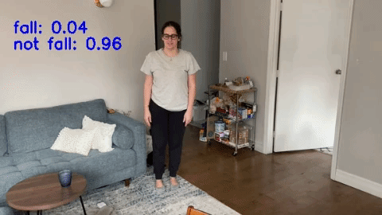

# Falling Net



## Introduction
Falls are one of the leading causes of injury in older persons. With around 27,000 seniors succumbing annually due to falls, there is a glaring need to confront this issue. We created an adaption of the Temporal Shift Module developed by the MIT HAN Lab to detect human falls, assessing the feasibility for a home camera system to detect falls as they occur.


## Requirements
* Python 3.5 or greater
* Jetson TX2
* Docker

## Setup
1. Build the docker image and run your container

```
docker built -t tsm_test1 .

docker run --privileged -v $(pwd):/falling -v /dev/bus/usb:/dev/bus/usb -v /tmp:/tmp -e QT_X11_NO_MITSHM=1 -e DISPLAY=$DISPLAY -it falling_net bash
```

2. The demo script can be run either using the camera feed or using a local video

```
python3 main.py --video ./test_video/test_fail.avi
```

To use the camera, please exclude the `--video` option
